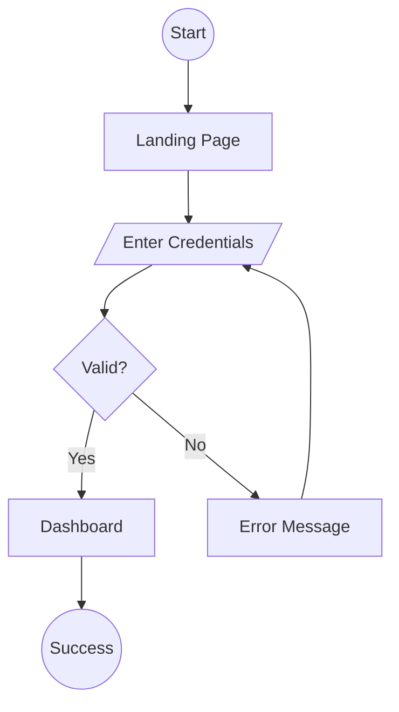

## User Input

```text
$ARGUMENTS
```

You **MUST** consider the user input before proceeding (if not empty).

## Outline

Generate Mermaid flowchart diagrams for each user story in the specification, showing the complete user journey through the application.

1. **Locate Feature Directory**:
   - Get current git branch name
   - Extract feature identifier (e.g., `001-feature-name`)
   - Set FEATURE_DIR = `specs/{branch-name}`
   - Verify FEATURE_DIR exists

2. **Load Required Documents**:
   - Read `{FEATURE_DIR}/spec.md` - REQUIRED (ERROR if missing)
   - Read `/memory/constitution.md` if present (for project principles)

3. **Extract User Stories**:
   - Parse all user stories from spec.md
   - For each story, identify:
     - Actor (who performs the flow)
     - Trigger (what initiates the flow)
     - Goal (desired outcome)
     - Acceptance criteria (defines success/failure paths)

4. **Generate User Flows**:
   - Load `templates/userflows-template.md` for output structure
   - For each user story, create a Mermaid flowchart:

     ```mermaid
     flowchart TD
         A((Start)) --> B[First Screen/Action]
         B --> C{Decision Point}
         C -->|Success| D[Next Step]
         C -->|Failure| E[Error Handling]
         D --> F((End: Goal Achieved))
         E --> G{Retry?}
         G -->|Yes| B
         G -->|No| H((End: Cancelled))
     ```

   - Include Flow Details table with:
     - Step number
     - Screen name
     - User action
     - System response
     - Next step

   - Document Decision Points:
     - What condition determines the branch
     - Path A outcome
     - Path B outcome

   - Document Error Paths:
     - Error condition
     - How it's handled
     - Recovery action

5. **Create Navigation Overview**:
   - Generate a high-level Mermaid diagram showing how all flows connect
   - Group flows by category (Onboarding, Main App, Settings, etc.)
   - Show cross-flow dependencies

6. **Write Output**:
   - Write complete userflows document to `{FEATURE_DIR}/userflows.md`
   - Include all sections from template:
     - Individual flow diagrams (one per user story)
     - Flow details tables
     - Navigation overview
     - Cross-flow dependencies
     - Flow diagram legend

7. **Report Completion**:
   - Display summary: number of flows generated, screens identified
   - Suggest next step: `/speckit.ia` to create information architecture

## Mermaid Syntax Guidelines

Use these patterns for consistent, renderable diagrams:

### Node Types
```
((Circle))     - Start/End points
[Rectangle]    - Screens or pages
{Diamond}      - Decision points
[/Parallelogram/] - User input
```

### Connections
```
A --> B        - Direct flow
A -->|Label| B - Labeled transition
A -.-> B       - Optional/async flow
```

### Example Flow Structure


## Key Rules

- Every user story MUST have a corresponding flow diagram
- Decision points MUST have clear, mutually exclusive conditions
- Error paths MUST show recovery actions
- Flows should be independently testable
- Use consistent naming for screens across flows
- Keep diagrams readable (max 15 nodes per flow, split if larger)
