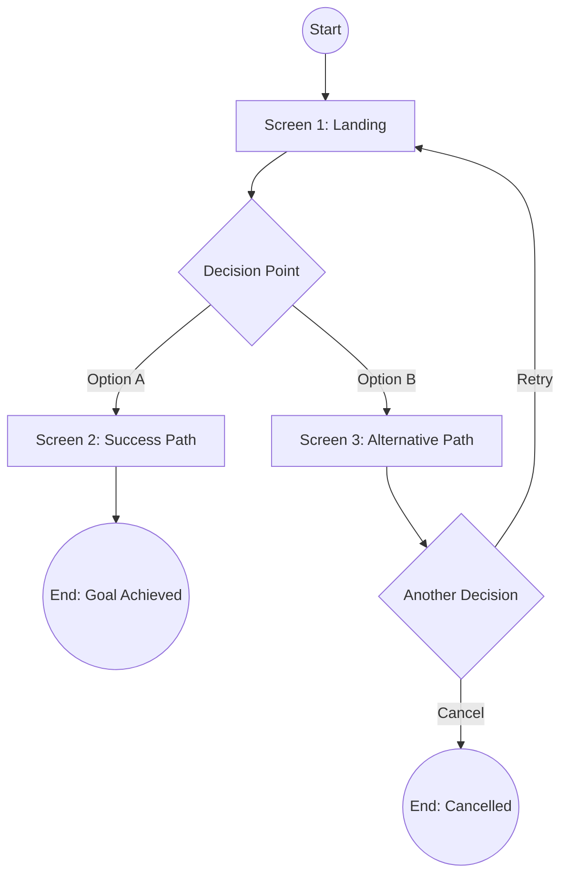
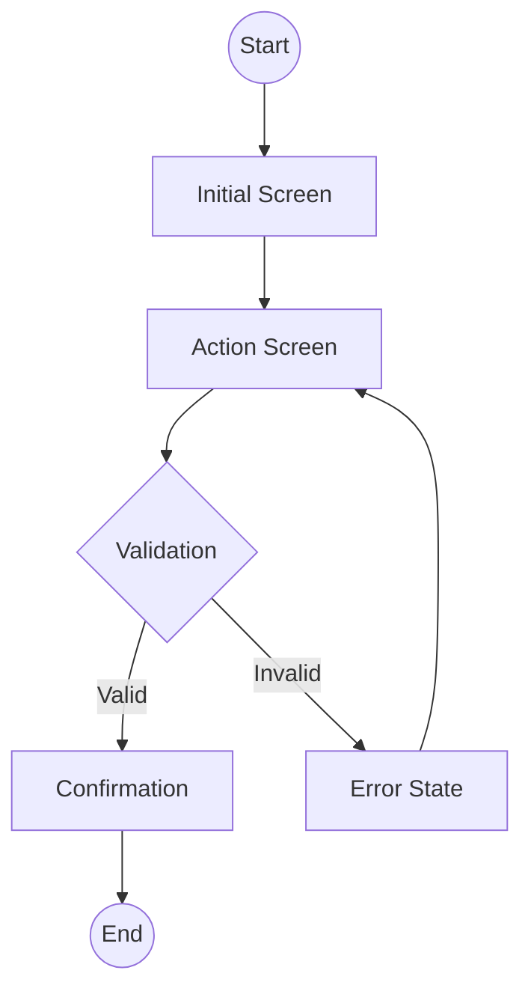

# User Flows: [FEATURE NAME]

**Feature Branch**: `[###-feature-name]`
**Created**: [DATE]
**Source**: [spec.md](./spec.md)

## Overview

This document contains user journey maps for all user stories defined in the specification. Each flow shows how users navigate through the application to accomplish their goals.

---

## Flow 1: [User Story 1 Title]

**Actor**: [Who performs this flow - e.g., "Guest User", "Admin"]
**Trigger**: [What initiates this flow - e.g., "User clicks Sign In"]
**Goal**: [What the user wants to achieve]



### Flow Details

| Step | Screen | User Action | System Response | Next Step |
|------|--------|-------------|-----------------|-----------|
| 1 | [Screen Name] | [What user does] | [What system shows] | [Next screen] |
| 2 | [Screen Name] | [What user does] | [What system shows] | [Next screen] |

### Decision Points

| Decision | Condition | Path A | Path B |
|----------|-----------|--------|--------|
| [Decision name] | [What determines choice] | [If yes/true] | [If no/false] |

### Error Paths

| Error Condition | Handling | Recovery |
|-----------------|----------|----------|
| [What can go wrong] | [Error message/screen] | [How user recovers] |

---

## Flow 2: [User Story 2 Title]

**Actor**: [Who]
**Trigger**: [What starts it]
**Goal**: [Desired outcome]



---

## Navigation Overview

High-level view of how flows connect:

```mermaid
flowchart LR
    subgraph Onboarding
        Login --> Dashboard
        Register --> Verify --> Dashboard
    end

    subgraph Main App
        Dashboard --> Feature1
        Dashboard --> Feature2
        Feature1 --> Detail
    end

    subgraph Settings
        Dashboard --> Settings
        Settings --> Logout
    end
```

---

## Cross-Flow Dependencies

| Flow | Prerequisites | Enables | Shared Screens |
|------|--------------|---------|----------------|
| Login | None | All authenticated flows | Dashboard |
| [Flow Name] | [Required flows] | [Unlocked flows] | [Common screens] |

---

## Flow Diagram Legend

| Symbol | Meaning |
|--------|---------|
| `((Circle))` | Start/End point |
| `[Rectangle]` | Screen or page |
| `{Diamond}` | Decision point |
| `[/Parallelogram/]` | User input |
| `-->` | Navigation/transition |
| `-->\|Label\|` | Conditional transition |

---

## Notes

- All flows assume user is authenticated unless marked with "(Guest)"
- Error states should return user to last valid state
- Each decision node should have clear, mutually exclusive conditions
- Flows should be independently testable per user story
